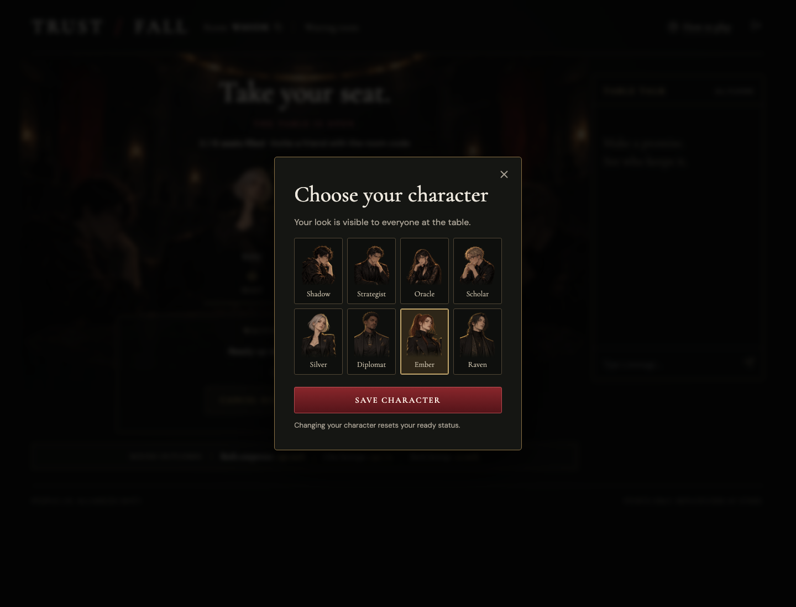
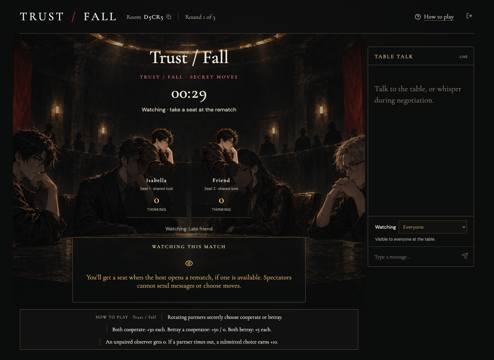

# TRUST / FALL

A collection of 22 browser social strategy games for 2–6 seats. Negotiate, submit secret moves, reveal together, and compete across 3, 5 or 7 rounds. Share the public link and a five-character room code. Players do not need an account.

## Play the game

[Open TRUST / FALL](https://trust-fall-table.actionintime.chatgpt.site) · [GitHub Pages entry](https://wuisabel-gif.github.io/trust-fall/)

The GitHub Pages link opens the live game. Multiplayer state and scoring run on the shared backend; GitHub Pages hosts the entry redirect on the `gh-pages` branch.

### 1. Enter your name

Choose one of eight character portraits, enter your name, then create a new table or join a friend’s table. No login or installation is required.

### 2. Join with a room code

Enter your name and the host’s five-character room code, then click **Join table**. Invitation links fill in the code automatically.

### 3. Meet in the waiting room

Players on separate devices appear at the same table. The host chooses a mode card, round count (3/5/7) and negotiation timer (30/45/60/90 seconds). Changing the mode or settings resets readiness. Everyone clicks **I’m ready**, then the host clicks **Start game**.

You can also click **Change character** in the waiting room. Saving a new look updates it for everyone and resets your ready status.

### 4. Negotiate and choose in secret

Chat, make promises, and lock in a mode-specific move (for example, **Cooperate** or **Betray** in the original mode). Choices reveal together and the server updates everyone’s scores.

During negotiation, choose a player in **Send to** for a private whisper. The server returns each whisper only to its sender and recipient, even after reveal. Bots ignore whispers. Revealed move dots under portraits show cooperation (gold), betrayal (crimson), other moves (neutral), and missed/observer rounds (hollow). Focus or hover a dot for details.

At match end, a round-by-round recap shows moves, targets and point changes. Awards include tied winners; “Biggest swing” is the largest difference between consecutive round gains. Cooperation/betrayal awards apply to Trust / Fall and Three Apples.

Late joiners and players joining a full table watch as spectators. They see public chat and reveals, but cannot send messages or make moves. At rematch, waiting humans take available seats in arrival order, replacing AI seats first. If six humans remain seated, viewers wait for an opening and use **Take a seat** in the lobby. The gallery holds up to 20 spectators. Duplicate portraits are marked by seat number and “shared look”.

These screenshots show real browser sessions. The pictured rooms are examples; create a fresh table to play.

## Game collection

The lobby offers 22 modes, each with in-game instructions, secret choices, server scoring and AI seats. See [mode adaptations](docs/game-modes.md) for scope and rules. These are short independent adaptations, not a reproduction of the manga tournament. Modes with absent source rules (such as Mask Exchange) are explicitly original designs.

## Game flow

Create or join → everyone ready → host starts → host-selected negotiation timer → secret locked choices → reveal → 12-second intermission → next round → winner → host opens rematch.

In Trust / Fall, pairings rotate and unpaired observers earn 0. In every mode, unsubmitted moves time out for −10 points, never an automatic move. Players who never submit a move cannot win. Both cooperate earns 30 each; unilateral betrayal earns 50 versus 0; mutual betrayal earns 5 each. Tied leaders share the win.

## Solo practice with AI

You do not need six people. Modes need two or three seats, including bots; you can practice alone:

1. Create a table.
2. Choose a game, then click **Add AI player** for one opponent, or **Fill empty seats with AI** for a full table.
3. Click **I’m ready**, then **Start game**.

AI seats are clearly marked and are ready automatically. The host can remove them in the waiting room. You can mix real friends and AI in the same room.

These are built-in strategy bots with different bluffing styles. They use past reveals, make timed secret choices, and choose from personality-specific table-talk lines with reactions to past moves and standings. Dialogue avoids recent repetition and duplicate lines within the same round. They cannot inspect current human choices. No external AI API or key is needed.

## Architecture

React/Vinext client → same-origin game API → Cloudflare D1.

The server owns the room state, timer, pairing, choices, and scores. Browsers poll roughly every 900ms; this synchronizes separate devices without client-authoritative state. Compare-and-swap room versions prevent concurrent moves from overwriting each other. Seat credentials stay in sessionStorage; opponent choices and credentials are never returned by the API. Rooms expire after 24 hours. Creating a table deletes rooms inactive for more than 24 hours.

## Development

Install dependencies, run `npm run db:generate` after schema changes, and apply the generated migration to local D1 before using `npm run dev`. `npx tsc --noEmit --incremental false` checks types. `npm run test:game` tests all modes at every supported match length, legal moves, AI, private state, timeouts, scoring, awards and spectator rematches. `npm run test:api` tests the real route handlers against in-memory SQLite for cleanup, concurrent joins, compare-and-swap retries, authentication and whisper privacy. Sites packaging applies committed migrations to production.

## Validation

Tested two isolated browser contexts (desktop 1536×1024 and mobile 390×844), synchronized chat, private choice visibility, lock immutability, scoring, reload recovery, five rounds, winning, rematch, rules, and mobile overflow. Engine checks cover 2–6 player pairing, all payoff combinations, timeout penalties, and host restrictions. Additional three-client tests cover whisper delivery/exclusion, spectator join, rematch promotion, settings, mode cards, recap and phone layout. Physical devices and large concurrent audiences have not been load-tested.

Art was generated with built-in imagegen from the approved concept: a charcoal underground tournament room with four original adult anime competitors, dark round table, muted crimson banners, gold rim lighting, and no text or interface. Asset: `public/tournament-room.png`.

## Source and assets

Source repository: https://github.com/wuisabel-gif/trust-fall (public).

Player seats use a dedicated transparent portrait strip. See `docs/art-assets.md` for asset paths and generation details. Changes are committed in small focused steps.
