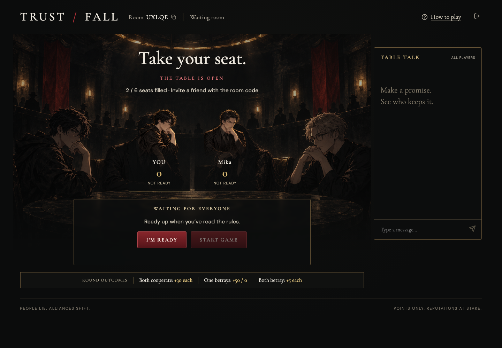

# TRUST / FALL

A browser game for 2–6 players: negotiate, cooperate or betray, reveal choices, and compete for points across five rounds. Share the public link and a five-character room code. Players do not need an account.

## Play the game

[Open TRUST / FALL](https://trust-fall-table.actionintime.chatgpt.site) · [GitHub Pages entry](https://wuisabel-gif.github.io/trust-fall/)

The GitHub Pages link opens the live game. Multiplayer state and scoring run on the shared backend; GitHub Pages hosts the entry redirect on the `gh-pages` branch.

### 1. Enter your name

Create a new table or join a friend’s table. No login or installation is required.

### 2. Join with a room code

Enter your name and the host’s five-character room code, then click **Join table**. Invitation links fill in the code automatically.

### 3. Meet in the waiting room

Players on separate devices appear at the same table. Everyone clicks **I’m ready**, then the host clicks **Start game**.

### 4. Negotiate and choose in secret

Chat, make promises, and lock in **Cooperate** or **Betray**. Choices reveal together and the server updates everyone’s scores.

These screenshots were captured from the actual deployed game using two separate browser sessions. The pictured room is an example; create a fresh table to play.

## Game flow

Create or join → everyone ready → host starts → 45-second negotiation → secret locked choices → reveal → 12-second intermission → next round → winner → host opens rematch.

Pairings rotate. Odd-player rounds award the observer 15 points. Unsubmitted choices default to cooperation. Both cooperate earns 30 each; unilateral betrayal earns 50 versus 0; mutual betrayal earns 5 each. Tied leaders share the win.

## Architecture

React/Vinext client → same-origin game API → Cloudflare D1.

The server owns the room state, timer, pairing, choices, and scores. Browsers poll roughly every 900ms; this synchronizes separate devices without client-authoritative state. Compare-and-swap room versions prevent concurrent moves from overwriting each other. Seat credentials stay in sessionStorage; opponent choices and credentials are never returned by the API. Rooms expire after 24 hours.

## Development

Install dependencies, run `npm run db:generate` after schema changes, and apply the generated migration to local D1 before using `npm run dev`. `npx tsc --noEmit` checks types. Sites packaging applies committed migrations to production.

## Validation

Tested two isolated browser contexts (desktop 1536×1024 and mobile 390×844), synchronized chat, private choice visibility, lock immutability, scoring, reload recovery, five rounds, winning, rematch, rules, and mobile overflow. Engine checks cover 2–6 player pairing, all payoff combinations, timeout defaults, and host restrictions. Physical devices and large concurrent audiences have not been load-tested.

Art was generated with built-in imagegen from the approved concept: a charcoal underground tournament room with four original adult anime competitors, dark round table, muted crimson banners, gold rim lighting, and no text or interface. Asset: `public/tournament-room.png`.

## Source and assets

Source repository: https://github.com/wuisabel-gif/trust-fall (public).

Player seats use a dedicated transparent portrait strip. See `docs/art-assets.md` for asset paths and generation details. Changes are committed in small focused steps.
