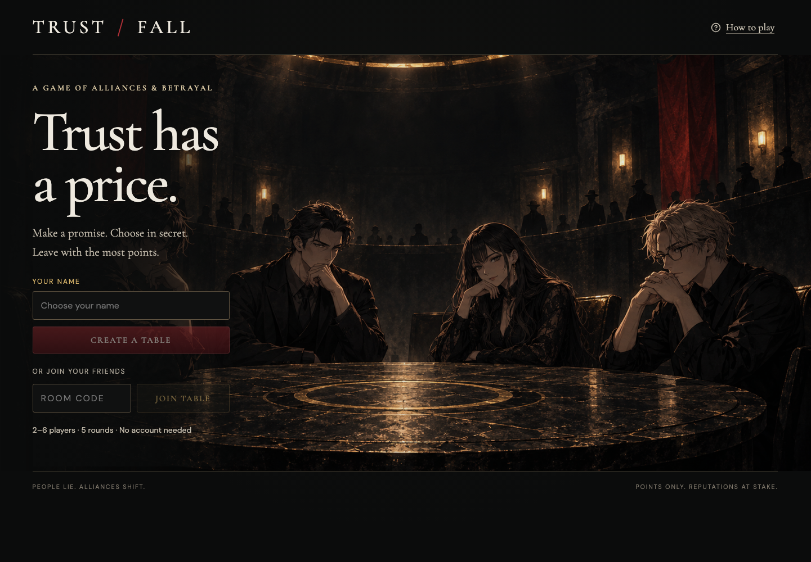
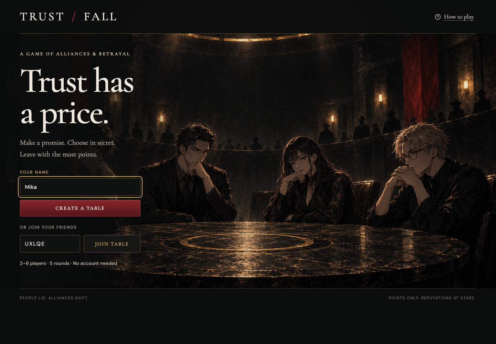
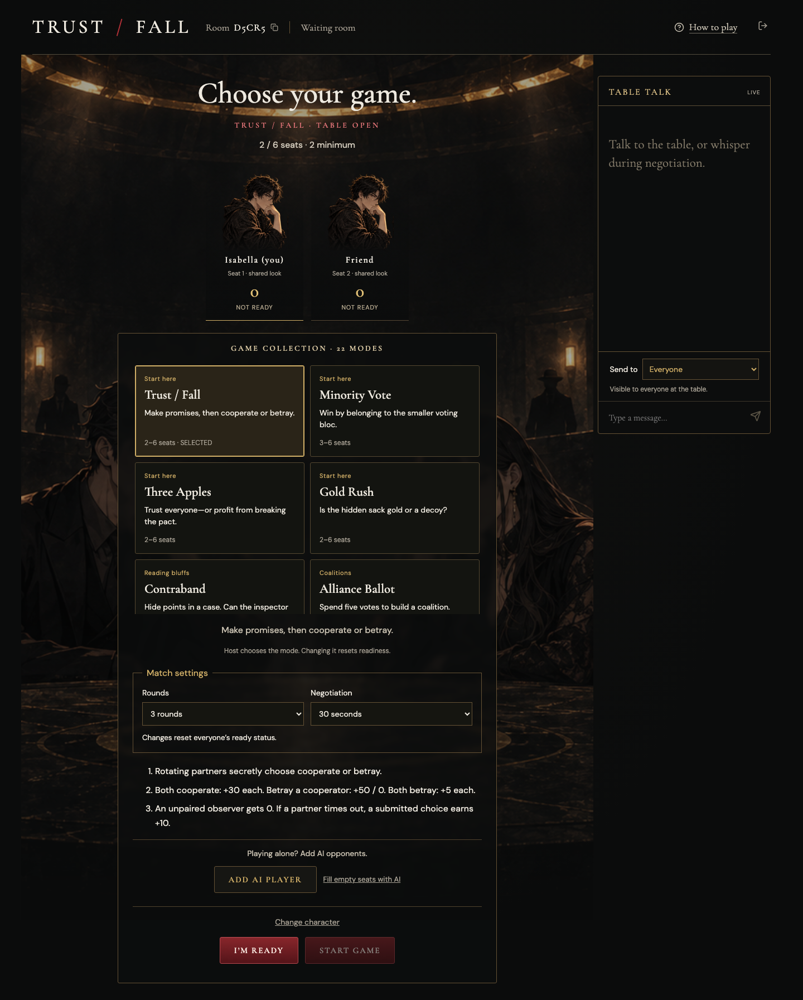
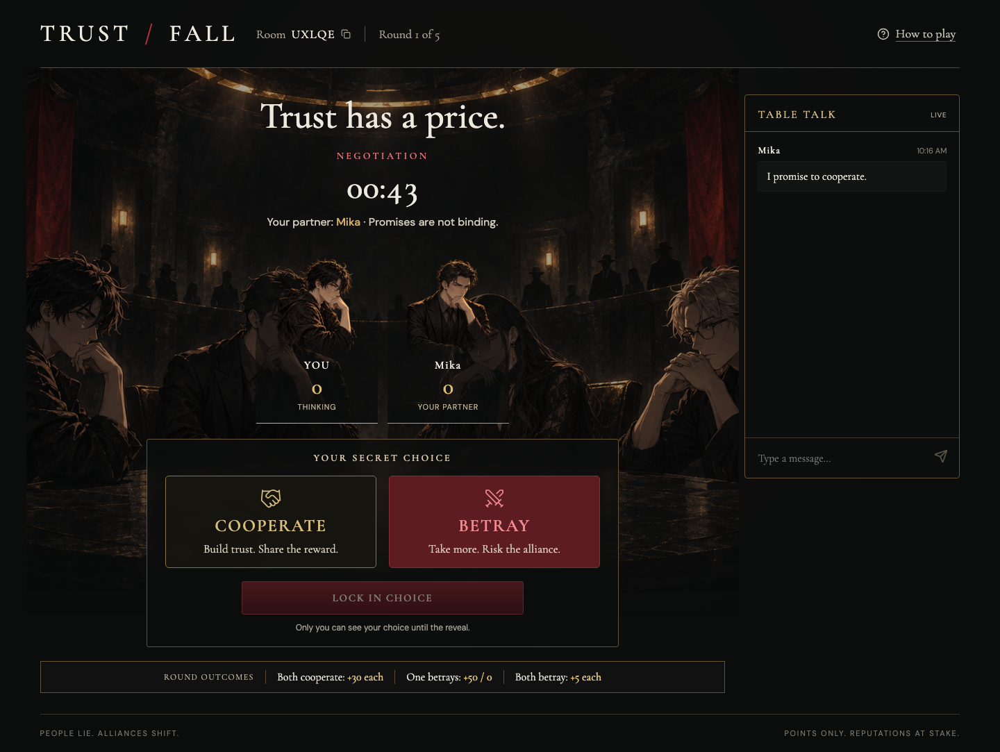
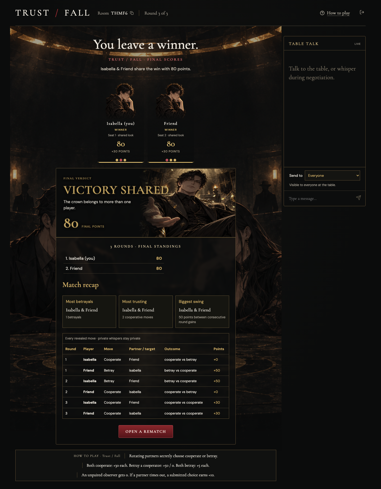
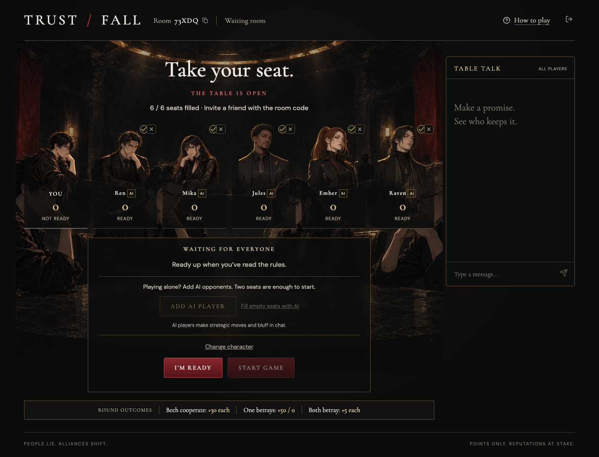

# TRUST / FALL

[English](README.md) | **简体中文**

包含 22 种浏览器社交策略游戏的合集，支持 2–6 个席位。玩家通过谈判、秘密行动和共同揭晓，在 3、5 或 7 轮中争夺积分。分享公开链接和五位房间号，即可从不同设备加入，无需注册账号。

> 本页为中文项目说明；游戏界面目前使用英文。

## 在线游玩

[打开 TRUST / FALL](https://trust-fall-table.actionintime.chatgpt.site) · [GitHub Pages 入口](https://wuisabel-gif.github.io/trust-fall/)

GitHub Pages 的 `gh-pages` 分支提供跳转入口。实际多人同步和计分由在线游戏后端处理。

1. 从八个角色头像中选择外观，输入昵称，创建桌子或加入朋友。
2. 输入房主提供的五位房间号，点击 **Join table**。邀请链接会自动填入房间号。
3. 房主选择玩法卡片、轮数（3/5/7）和谈判时间（30/45/60/90 秒）。所有玩家点击 **I’m ready**，房主再点击 **Start game**。
4. 在聊天中谈判，秘密确认行动，等待共同揭晓和服务器计分。终局后由房主开启下一局。





大厅中的 **Change character** 可修改外观；修改后会同步给所有人并取消自己的准备状态。相同头像会标记席位编号和“shared look”。

## 谈判、信誉与复盘

谈判阶段可在 **Send to** 中选择一名玩家发送私聊。服务器只向发送者和接收者返回该消息，揭晓后也不会公开；AI 忽略私聊。

头像下的历史圆点表示合作（金色）、背叛（红色）、其他行动（中性色），以及缺席或观察轮（空心）。悬停或聚焦可查看详情。



终局复盘逐轮显示行动、目标和积分变化，并提供合作、背叛及最大波动等奖项。最大波动指相邻两轮所得积分之差；合作和背叛奖适用于 Trust / Fall 与 Three Apples，并列者共享奖项。



中途加入或满桌时可观战，查看公开聊天和揭晓，但不能发言或行动。重开时按顺序优先安排真人入座，先替换 AI；若六个真人席位均满，观众需等待空位并在大厅点击 **Take a seat**。最多支持 20 名观众。

## 玩法与计分

22 种模式各有游戏内规则、秘密行动、服务器计分和 AI 策略。详见 [玩法改编说明](docs/game-modes.md)（英文）。这些是适合短局的独立改编，并非完整重现漫画赛事；缺少原始规则的玩法会明确标为原创设计。

流程：创建或加入 → 准备 → 开局 → 谈判 → 锁定行动 → 揭晓 → 12 秒间隔 → 下一轮 → 终局 → 重开。

在原版 Trust / Fall 中，配对每轮轮换；落单观察者得 0 分。双方合作各得 30 分，单方背叛得 50 分而对方得 0 分，双方背叛各得 5 分。所有模式中，超时未提交扣 10 分，不会自动替玩家行动；整局从未提交行动者不能获胜。最高分相同则共享胜利。

## AI 单人练习

不需要凑齐六个人。各模式最少需要两个或三个席位，AI 也计入人数。

1. 创建桌子并选择玩法。
2. 点击 **Add AI player** 添加一个 AI，或 **Fill empty seats with AI** 补满席位。
3. 点击 **I’m ready**，再开始游戏。

AI 自动准备，房主可在大厅移除，也可与真人混合游玩。它们是内置策略机器人，依据过去揭晓、积分和各自风格做选择与发言，并避免近期重复台词。它们无法查看本轮真人的秘密选择；不需要外部 AI API 或密钥。



## 技术架构

React / Vinext 客户端 → 同源游戏 API → Cloudflare D1。

服务器管理房间、计时、配对、行动和积分。浏览器约每 900 毫秒轮询，多个设备共享同一份权威状态。CAS 版本检查防止并发覆盖。席位凭据保存在 sessionStorage；API 不返回其他人的秘密选择或凭据。房间 24 小时后失效，创建房间时清理超过 24 小时未更新的记录。

## 本地开发与验证

安装依赖后，修改数据库结构时运行 `npm run db:generate`，并在使用 `npm run dev` 前将已生成迁移应用到本地 D1。正式发布由 Sites 应用已提交的迁移。

```sh
npm ci
# 先将已提交的数据库迁移应用到本地 D1
npm run dev
```

```sh
npx tsc --noEmit --incremental false
npm run test:game
npm run test:api
```

规则测试覆盖各模式、支持轮数、合法行动、AI、秘密状态、超时、计分、奖项和观众重开入座。API 测试使用内存 SQLite 验证真实路由的清理、并发加入、CAS 重试、认证和私聊隔离。

浏览器测试覆盖桌面与手机尺寸的独立会话、同步聊天、秘密选择、锁定、计分、刷新恢复、完整比赛和重开；三客户端测试覆盖私聊、观众、设置和复盘。尚未进行真实物理设备或大规模并发压力测试。

## 源码与美术

[公开源码仓库](https://github.com/wuisabel-gif/trust-fall)。原创动漫美术由内置图像生成工具制作，采用炭黑、金色和深红色设计。背景为 `public/tournament-room.png`，玩家席位使用独立透明人物素材。详情见 [美术说明](docs/art-assets.md)（英文）。

截图来自真实浏览器测试，图中的房间号仅为示例，请创建新桌子游玩。
